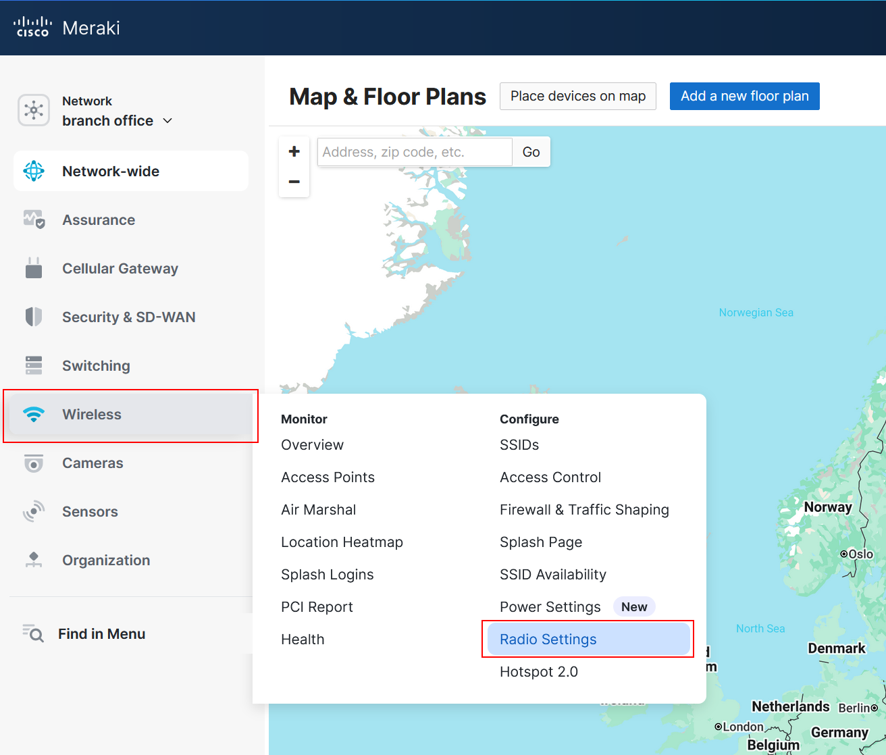
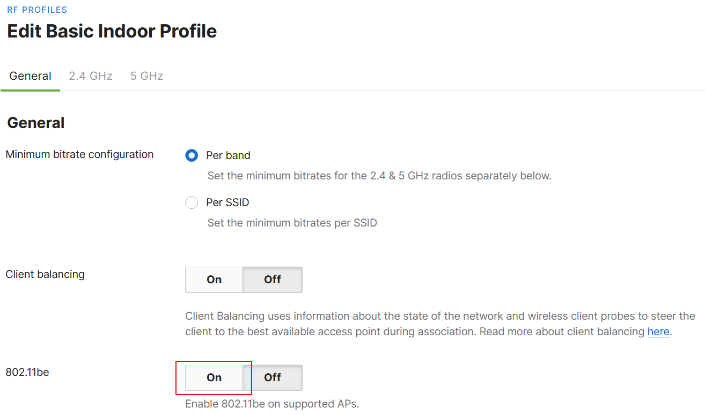
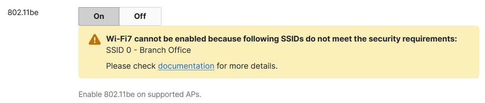
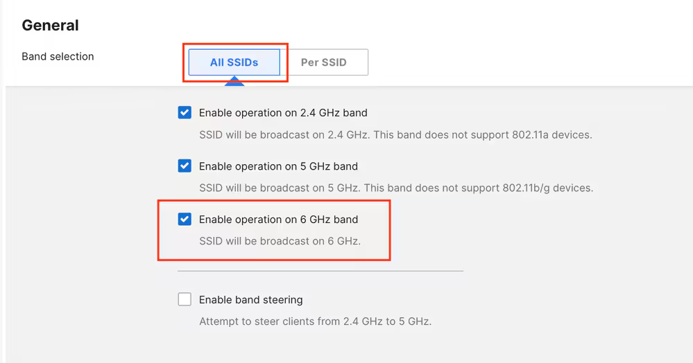

**Enable 802.11be Operation**

When adding Wi-Fi 7-capable APs (for example CW9178I, CW9176I/D1) to a Cisco Meraki Dashboard network for the first time, support for 802.11be operation is on their default RF Profile.

To activate it, we need to navigate under **Wireless > Radio Settings**.

 Click on the **RF Profile** tab and select the profile assigned to the AP (default: 'Basic Indoor Profile' for indoor APs).

In the General section, enable **802.11be** as shown in this screenshot:

If one or more WLANs are configured with security settings weaker than those required by the Wi-Fi 7 specification, the Dashboard displays a banner alerting users as shown hereafter.

While the Dashboard allows the configuration to be saved, Wi-Fi 7 is not enabled on the flagged SSIDs until compliance with the Wi-Fi 7 requirements is ensured.

> **Note**: Once the configuration of the SSID meets the Wi-Fi 7 minimum criteria, the banner disappears.

**Enable 6 Ghz Operation**

In the same RF Profile, make sure to enable 6 GHz operation on the APs. This can be done either for all the SSIDs in bulk or per individual SSID. Note that Band Steering is available only between 2.4 and 5 GHz.

Below is an example of 6 GHz enablement for all the SSIDs:

Similarly, 6 Ghz can be enabled for a specific SSID in the "per SSID" tab.

Congratulations,  you have enabled Wi-Fi7 and 6Ghz operation globally and, optionally, for specific SSIDs!

