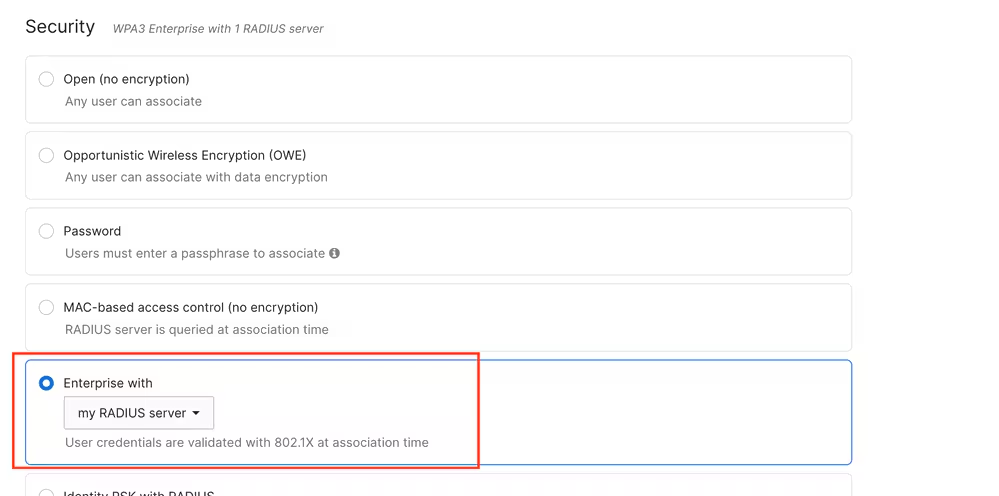
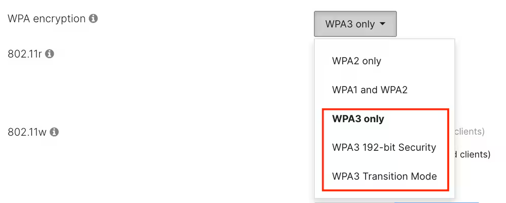
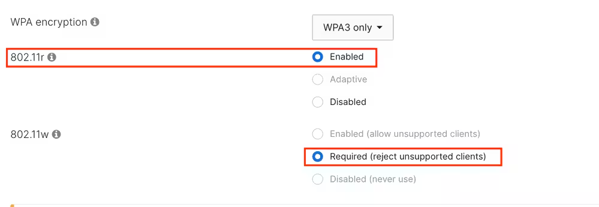
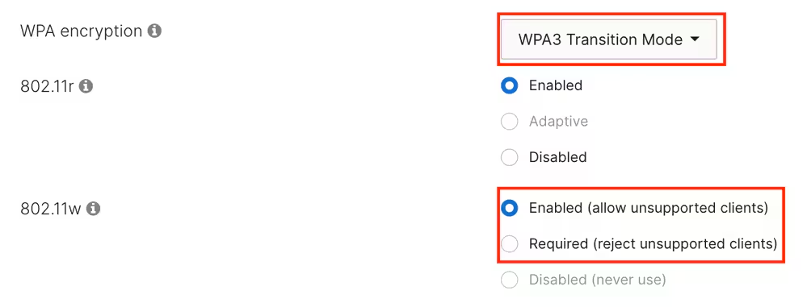
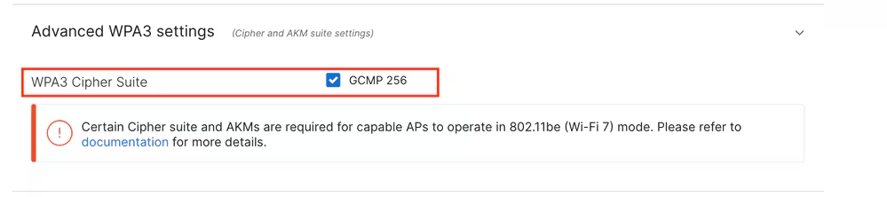

WPA3-Enterprise operation is available only with an external RADIUS server (aka "my RADIUS server"). WPA3-Enterprise is not available with Meraki Cloud Authentication.

Starting with MR 31.x, the available WPA3 types are:

- **WPA3 only**, which uses the same ciphers as WPA2, but requires 802.11w (PMF).
- **WPA3 192-bit**, which allows only the EAP-TLS method with chipers TLS_ECDHE_ECDSA_WITH_AES_256_GCM_SHA384, TLS_ECDHE_RSA_WITH_AES_256_GCM_SHA384, or TLS_DHE_RSA_WITH_AES_256_GCM_SHA384. This mode requires configuring the same chipers on the RADIUS server to enable this mode.
- **WPA3 Transition Mode** (mixed mode), which allows the coexistence of WPA2 clients on the same WLAN used for WPA3. 

When using **WPA3 only** or **WPA3 192-bit Security**, Protected Management Frame (PMF) is mandatory for all clients.

In most applications, **Fast Transition  (802.11r)**, while not mandatory, must better be enabled to mitigate the impact of roaming and re-authentication latency while using an external RADIUS server. 6 GHz operation also requires enabling PMF (802.11w). 

When selecting WPA3 Transition Mode, all the clients capable of using WPA3 default to using PMF. All the clients operating on 6 GHz use WPA3.

In this mode, you can select if the legacy client using WPA2 must use PMF (802.11w required) or if that feature is optional (802.11w enabled).

In all scenarios, Cisco Meraki Access Points require the GCMP 256 cipher suite to be enabled to operate in Wi-Fi 7 mode. Additionally, Beacon Protection is enabled by default when APs are operating in Wi-Fi 7 mode.

Congratulations! You have successfully configured WPA3-Enterprise!