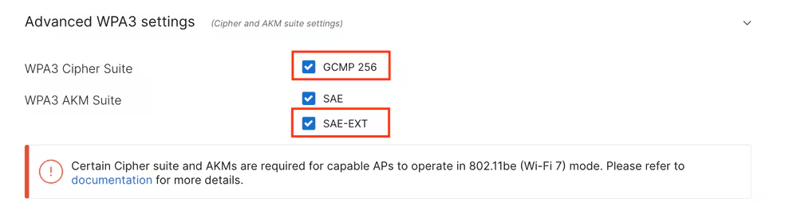

**WPA3-SAE**, or **WPA3-Personal**, is a Wi-Fi security protocol that uses the **Simultaneous Authentication of Equals (SAE)** handshake to replace WPA2's pre-shared key (PSK) method. It provides enhanced security by protecting against offline dictionary and brute-force attacks, and ensures forward secrecy, meaning past traffic cannot be decrypted even if the password is compromised. SAE is based on the *Dragonfly key exchange* and also mandates the use of Protected Management Frames (PMF) to encrypt management frames, significantly improving network security.  

To enable WPA3-SAE, you need to select and set password for users to associate:

Enabling a passphrase SSID for Wi-Fi 7, the certification mandates adding SAE-EXT-KEY and/or FT + SAE-EXT-KEY AKMs, along with GCMP256 cipher. Up to firmware MR 30.x, the only supported WPA type is 'WPA3 only', and the dashboard does not let you select a different method.

PMF is mandatory in this configuration, while FT (802.11r) is recommended to be enabled when using SAE:

To allow Wi-Fi 7 operation, the GCMP 256 chiper suite and SAE-EXT AKM suite must also be enabled upon configuration of the SSID. They are disabled by default, and can be enabled under **Advanced WPA3 settings.**

Congratulations! You have successfully configured WPA3-SAE!
