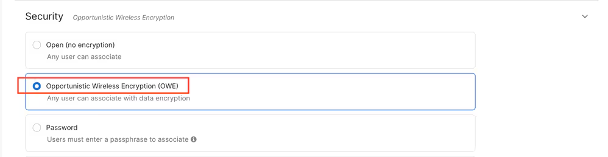
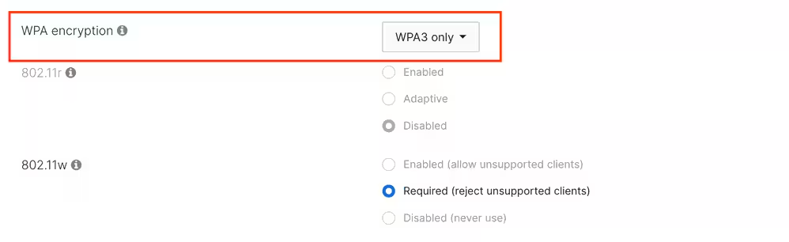
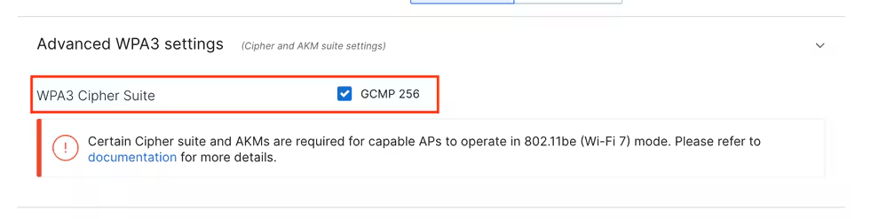

Guest networks come with many flavors. Typically, they require no 802.1X credentials or passphrase to connect, and possibly imply a splash page or portal, which can require credentials or a code. This is traditionally handled with an Open SSID and either local or external guest portal solutions. 

However, SSIDs with open security (no encryption) are not allowed on 6 GHz or for Wi-Fi 7 support.

Thus, the Enhanced Open was introduced. The Enhanced Open  is a certification provided by WiFi alliance as part of the WPA3 wireless security standard. It uses Opportunistic Wireless Encryption (OWE) on Open (unauthenticated) networks to prevent passive sniffing and prevent simple attacks as compared to a public PSK wireless network. 

Opportunistic Wireless Encryption (OWE) is an extension to IEEE 802.11 that provides encryption of the wireless medium. The purpose of OWE based authentication is avoid open unsecured wireless connectivity between the AP’s and clients. The OWE uses the Diffie-Hellman algorithms based Cryptography to setup the wireless encryption. With OWE, the client and AP perform a Diffie-Hellman key exchange during the access procedure and use the resulting pairwise master key (PMK) secret with the 4-way handshake. The use of OWE enhances wireless network security for deployments where Open or shared PSK based networks are deployed.

**OWE configuration on the Cisco Meraki dashboard**

The recommendation is to create a separate Guest SSID with Enhanced Open / OWE operating on 6 GHz on the Cisco Meraki dashboard.

This can be configured in **Wireless > Access Control**, and selecting **Opportunistic Wireless Encryption (OWE)** as the Security method.

When running firmware up to MR 31, the only supported WPA type is 'WPA3 only', and the dashboard does not let you select a different method. PMF is mandatory in this configuration, while FT (802.11r) cannot be enabled.

GCMP256 bits must be enabled alongside CCMP128 for compliance with Wi-Fi 7 requirements.

